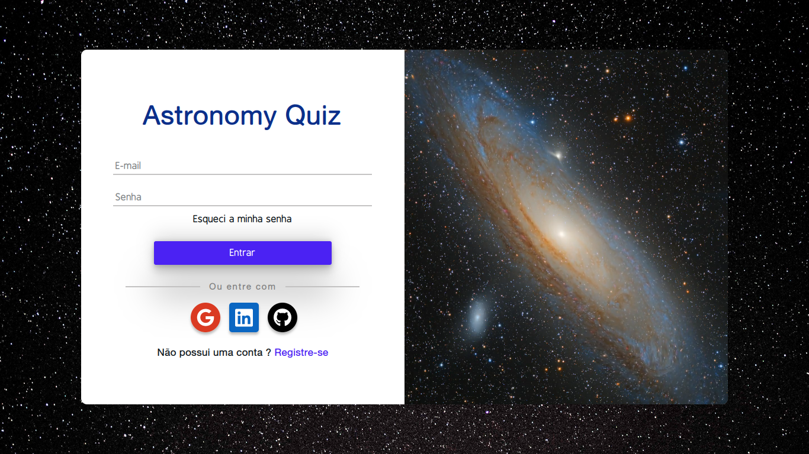

<h1 align="center">Astronomy quiz (Api)</h1>

    

<h1 align="center">
    <a href="https://github.com/MarcoLGP/astronomy-quiz-public">🔗 Astronomy quiz (Front-end)</a>
</h1>

🚀 Api do projeto astronomy quiz

Tabela de conteúdos
=================
<!--ts-->
   * [Sobre](#Sobre)
   * [Informações](#Informações)
   * [Tecnologias](#Tecnologias)
<!--te-->

<h2 id=="Sobre">Sobre</h2>

Projeto possui o intuito didático, sem fins lucrativos.

A motivação principal do projeto é fazer uma publicação da minha manipulação das principais tecnologias do mercado, as quais utilizo em projetos em que empreendo, e que não posso deixar o repositório publico.

<h2 id="Informações">Informações</h2>

O projeto utiliza conceitos da arquitetura clean architeture, que na minha opinião pessoal, é a melhor arquitetura atualmente para projetos escaláveis, devido a sua praticidade de manutenção.

<h2 id="Tecnologias">Tecnologias</h2>

Os bancos de dados do projeto são: Postgres(SQL) e Mongo(NoSQL), sendo o mongo o banco para armazenar os tokens já utilizados para restauração de senhas.

Typescript para auxiliar no desenvolvimento com as tipagens e utilizar o paradigma orientado a objetos.

E demais lib's para tornar o projeto funcional, como jsonwebtoken para criar os tokens e crypto para criptografar informações sensíveis.

